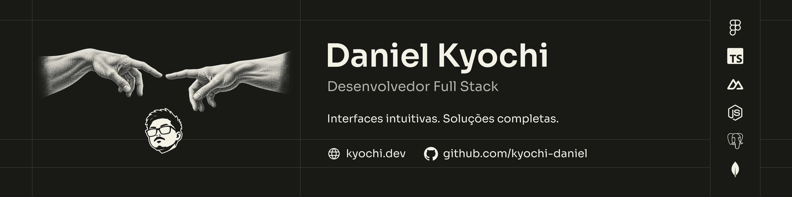

### Olá 👋

Sou desenvolvedor web frontend e fullstack, autônomo desde 2020. Crio interfaces, sistemas e automações que simplificam rotinas e resolvem problemas reais.

- **Stack principal:** TypeScript, Vue, Nuxt e Node.js.
- **Dados:** PostgreSQL, MongoDB e Supabase.
- **Também utilizo:** JavaScript, React, Figma, Git e VS Code.
- **Formação:** pós-graduação em Engenharia de IA Aplicada em andamento; estudos de desenvolvimento web na [Rocketseat](https://rocketseat.com.br/).

[Portfólio](https://www.kyochi.dev/) · [LinkedIn](https://www.linkedin.com/in/daniel-kyochi/)
